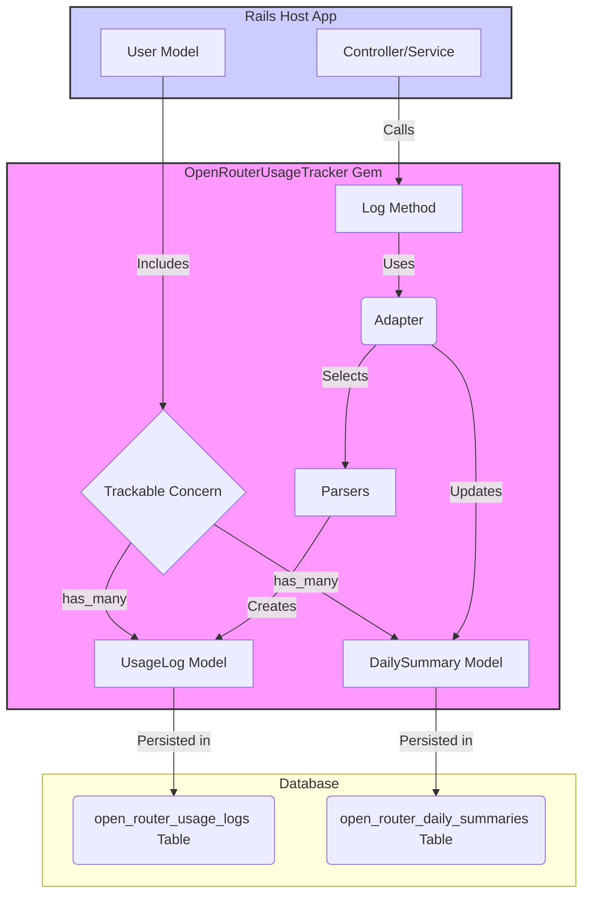
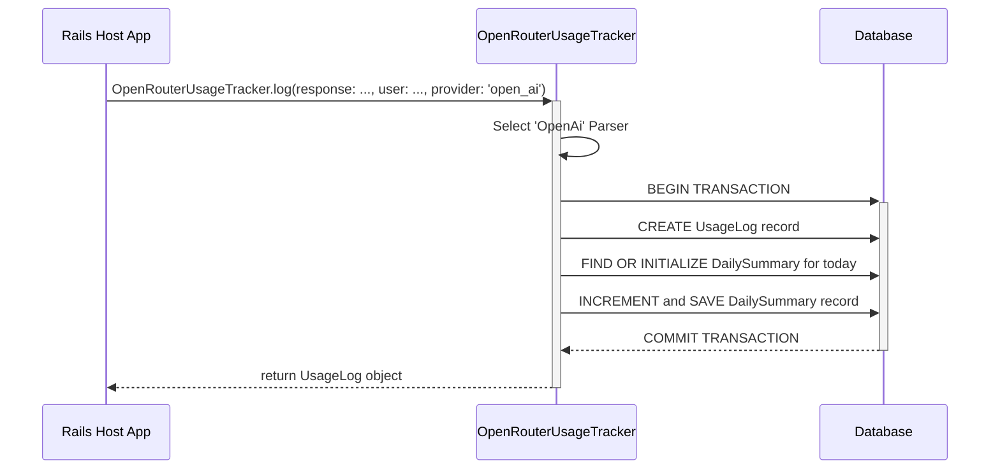

# OpenRouterUsageTracker [WIP]
[](https://github.com/mclpio/open_router_usage_tracker/actions)
[](https://badge.fury.io/rb/open_router_usage_tracker)

An effortless Rails engine to track API token usage and cost from multiple LLM providers, including [OpenRouter](https://openrouter.ai/), OpenAI, Google, and Anthropic. It enables easy rate-limiting and monitoring for your users.

## Motivation
Managing Large Language Model (LLM) API costs is crucial for any application that provides AI features to users. This gem provides simple, out-of-the-box tools to log every API call, associate it with a user, and query their usage over time. This allows you to easily implement spending caps, rate limits, or usage-based billing tiers across different providers.

## Installation
Add this line to your application's Gemfile:

```ruby
gem "open_router_usage_tracker"
```

And then execute:
```bash
bundle
```

Or install it yourself as:
```bash
gem install open_router_usage_tracker
```

## Setup

1.  **Run the Install Generator**: This will create a migration file in your application to add the `open_router_usage_logs` table.
    ```bash
    bin/rails g open_router_usage_tracker:install
    ```

2.  **Run the Summary Table Generator (New in v0.2.0)**: To enable performant daily rate-limiting, generate the migration for the summary table.
    ```bash
    bin/rails g open_router_usage_tracker:summary_install
    ```

3.  **Run the Database Migrations**:
    ```bash
    bin/rails db:migrate
    ```

4.  **Include the `Trackable` Concern**: To add the usage tracking methods to your user model, include the concern. This works with any user-like model (e.g., `User`, `Account`).
    ```ruby
    # app/models/user.rb
    class User < ApplicationRecord
      include OpenRouterUsageTracker::Trackable

      # ... rest of your model
    end
    ```

5.  **(IMPORTANT) Configure Data Retention**: The `Trackable` concern intentionally does not set a `dependent` option on the `usage_logs` and `daily_summaries` associations. This is a critical design choice to prevent accidental data loss. You must decide what happens to a user's usage data when their account is deleted.

    **To delete all usage data with the user (recommended for privacy):**
    ```ruby
    # app/models/user.rb
    class User < ApplicationRecord
      include OpenRouterUsageTracker::Trackable

      has_many :usage_logs, as: :user, class_name: "OpenRouterUsageTracker::UsageLog", dependent: :destroy
      has_many :daily_summaries, as: :user, class_name: "OpenRouterUsageTracker::DailySummary", dependent: :destroy
    end
    ```

    **To keep all usage data (e.g., for auditing or analytics):**
    ```ruby
    # app/models/user.rb
    class User < ApplicationRecord
      include OpenRouterUsageTracker::Trackable
      # No `dependent` option needed. The records will remain.
    end
    ```

## Usage
Using the gem involves two parts: logging new requests and tracking existing usage.

### Logging a Request
In your application where you receive a successful response from an LLM API, call the `log` method. It's designed to be simple and fail loudly if the data is invalid.

```ruby
# Assume `api_response` is the parsed JSON hash from the provider
# and `current_user` is your authenticated user object.

begin
  # For OpenRouter
  OpenRouterUsageTracker.log(response: open_router_response, user: current_user)

  # For OpenAI (or other providers)
  OpenRouterUsageTracker.log(response: openai_response, user: current_user, provider: "open_ai")
rescue ActiveRecord::RecordInvalid => e
  # This can happen if the response hash is missing required keys
  # (e.g., 'id', 'model').
  logger.error "Failed to log usage: #{e.message}"
rescue ArgumentError => e
  # This will be raised if the provider is not supported.
  logger.error "Unsupported provider: #{e.message}"
end
```

### Supported Providers
The gem currently supports the following providers:
- `open_router` (default)
- `open_ai`
- `google`
- `anthropic`

The gem will automatically parse the response from each provider to extract the relevant usage data. If a provider does not return a specific field (e.g., `cost`), it will be saved as `0`.

### Daily Usage Tracking and Rate-Limiting
For high-performance rate-limiting, the gem provides a method to query the daily summary table. This avoids slow `SUM` queries on the main log table.

The primary method is `daily_usage_summary_for(day:, provider:, model:)`, which provides a near-instantaneous check of a user's usage for a specific model on a given day.

**Example: Implementing a daily token limit for a specific model**

Imagine you want to prevent users from using more than 100,000 tokens per day for a specific model.

```ruby
# somewhere in a controller or before_action or validation
def enforce_daily_limit
  # Be sure to handle timezones correctly for your users.
  today = Time.zone.today
  
  # This check is extremely fast as it queries the small summary table.
  summary = current_user.daily_usage_summary_for(
    day: today,
    provider: "open_ai",
    model: "gpt-4o"
  )

  if summary && summary.total_tokens > 100_000
    render json: { error: "You have exceeded your daily token limit for this model." }, status: :too_many_requests
    return
  end
end
```


## Contributing
Open an issue first.

1. Fork the repository.
1. Create your feature branch (git checkout -b my-new-feature).
1. Commit your changes (git commit -am 'Add some feature').
1. Push to the branch (git push origin my-new-feature).
1. Create a new Pull Request.

## License
The gem is available as open source under the terms of the [MIT License](https://opensource.org/licenses/MIT).

## Extra




